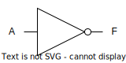
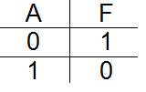
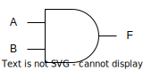
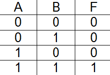
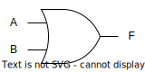
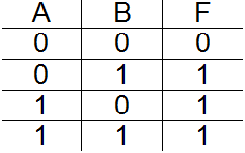
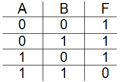
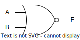
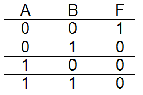
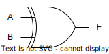

# Porți logice

Porțile logice sunt folosite în circuite digitale pentru a implementa operațiile din algebra booleană.
Fiindcă sunt foarte multe moduri în care o anumită funcție logică poate fi realizată (nu numai ca design de
circuit, ci și ca mod de fabricație al circuitelor integrate), porțile sunt grupate în **familii logice**.
Exemple de astfel de familii sunt:

- **Wired logic** (logică cablată cu diode): circuite extrem de ușor de realizat, folosind numai diode și rezistențe de pull-up/pull-down.
Sunt circuite pur pasive (nu au etaj final de amplificare), așa că nivelele logice de la ieșire sunt degradate (spre exemplu 0.6V în loc de `0V`, `4.4V` în loc de `5V`).

- **RTL** (resistor-transistor logic): prima formă de logică digitală ce foloseste elemente active, și anume tranzistori bipolari.
Logica este efectuată în etajul de intrare, utilizând rezistențe.
Dezavantajul acestei familii de porți logice este consumul foarte mare, din cauza tranzistorilor folosiți și a rezistențelor.

- **DTL** (diode-tranzistor logic): această familie combină logica cablata cu un etaj final cu tranzistori bipolari.

- **TTL** (transistor-transistor logic): reprezintă un avans față de DTL, folosind tranzistori bipolari, în general multiemitor, inclusiv în etajul de intrare.
Etajul de ieșire este realizat folosind 2 tranzistori, unul **NPN** și unul **PNP**, într-o conexiune ce poartă denumirea de **stâlp totemic** sau push-pull.

- **ECL** (emitter-coupled logic): o familie de mare viteză, ce folosește tot tranzistori bipolari, însă care nu intră niciodată în saturație.
Din acest motiv, marginea de zgomot (diferența dintre tensiunea în starea LOW și tensiunea în starea HIGH) este foarte mica, deci aceste circuite sunt susceptibile la zgomot.

- **NMOS** (N-type metal-oxide-semiconductor logic): spre deosebire de familiile anterioare, NMOS se folosește de tranzistori cu efect de camp (**FET**) și de rezistențe de pull-up.

- **CMOS** (complementary metal-oxide-semiconductor logic): nu folosește deloc rezistențe, ci tranzistori de tip nMOS și pMOS.
Este tehnologia folosita În prezent la fabricarea majorității dispozitivelor electronice.

După cum se poate vedea, aproape toate formele de logică digitală contin, într-un mod sau altul, tranzistori.

Din motive tehnice, este mai ușor să realizăm porți logice pentru funcțiile **NAND** și **NOR** decât pentru echivalentele lor în logica pozitivă, **AND** și **OR**.
Din această cauză, ne vom rescrie funcțiile logice astfel încat să folosim numai aceste operații.
Nu este ieșit din comun ca procesoare întregi să fie implementate utilizând doar porți NAND sau doar porți NOR.

## Inversorul NMOS

Să vedem cum poate fi realizată o poartă **NOT** în logică **NMOS**.

Funcționarea sa este următoarea:

- În starea HIGH pe intrare, (A), tranzistorul se deschide și trage $V_{out}$ (tensiunea la terminalul F) la masă.
- În starea LOW pe intrare, tranzistorul se închide și $V_{out}$ este tras la $V_{DD}$ de către rezistența R (numită rezistență de pull-up).

## Inversorul CMOS

Să vedem cum poate fi realizată o poartă **NOT** în logică **CMOS**.

Această poartă funcționează astfel:

- Observăm că cei doi tranzistori sunt legați în **stâlp totemic**: pMOS-ul legat la $V_{DD}$ și nMOS-ul legat la masă.

- Având intrările conectate în paralel, niciodată cei doi tranzistori nu vor fi deschiși în același timp.

- În starea LOW pe intrare tranzistorul pMOS este deschis iar cel nMOS este închis.
Ieșirea este legată la $V_{DD}$.

- În starea HIGH pe intrare tranzistorul pMOS este închis iar cel nMOS este deschis.
Ieșirea este legată la masă.

## Porți NAND și NOR cu CMOS

|                   NAND                |                 NOR                 |
|:-------------------------------------:|:-----------------------------------:|
| | |

## Reprezentarea porților logice

Pentru că tendința în electronică este, în general, "set-and-forget" (construim niște dispozitive din siliciu, le numim tranzistori și uităm de siliciu, apoi construim niște porți logice din tranzistori și uităm de tranzistori, apoi construim niște circuite integrate din porți logice
și uităm de porți logice, apoi construim niște procesoare din circuite integrate și uităm de circuite integrate, apoi uităm de electronica și programăm procesoarele în assembly, apoi uităm de assembly și programăm in C, apoi uităm de C și programăm în Java, apoi uităm tot și ne angajăm
la McDonalds), asta vom face și noi.
În loc de scheme bloc cu tranzistori, vom lucra cu imagini de ansamblu care să reprezinte porțile
logice la nivel conceptual.
De asemenea, vom înlocui valorile de tensiune cu nivele logice, LOW și HIGH.
Astfel, putem sâ rezumăm întreaga poveste în felul următor:

### Inversor (**NOT**)

Operator: $F = \neg A$

| Simbol | Tabel de adevăr |
|:------:|:---------------:|
|  |  |

### Poartă ŞI (**AND**)

Operator: $F = A \wedge B$

| Simbol | Tabel de adevăr |
|:------:|:---------------:|
|  |  |

### Poartă SAU (**OR**)

Operator: $F = A \vee B$

| Simbol | Tabel de adevăr |
|:------:|:---------------:|
|  |  |

### Poartă ŞI-NU (**NAND**)

Operator: $F = \neg (A \wedge B)$

| Simbol | Tabel de adevăr |
|:------:|:---------------:|
|  |  |

### Poartă SAU-NU (**NOR**)

Operator: $F = \neg (A \vee B)$

| Simbol | Tabel de adevăr |
|:------:|:---------------:|
|  |  |

### Poartă SAU EXCLUSIV (**XOR**)

Operator: $F = A \oplus B$

| Simbol | Tabel de adevăr |
|:------:|:---------------:|
|  |  |

## Circuite logice combinaționale

Circuitele logice combinaționale sunt circuitele reprezentate prin porți logice ce aplică o funcție pe intrări.
Valorile de ieșire depind doar de valorile de intrare, nu și de stări de reacție (feedback), iar când starea unei intrări se schimbă, se reflectă imediat la ieșiri.

Un circuit combinațional poate fi descris printr-o schema de interconectarea a unor porți logice, prin funcția (expresia) în logica booleană ce este aplicată pe intrări și prin tabele de adevăr (dacă nu au un număr prea mare de intrări).

Circuitele combinaționale sunt folosite în procesoare în cadrul componentelor de calcul, iar cele mai des întalnite sunt:

- Multiplexoare și demultiplexoare
- Sumatoare
- Codificatoare și decodificatoare
- Comparatoare
- Memorii ROM (read-only, nu păstrează starea)

## Multiplexoare

Un multiplexor digital este un circuit combinațional care implementează o funcție de selecție a uneia dintre intrările sale.
Alegerea semnalului de ieșire se face pe baza unor intrări suplimentare care reprezintă în baza 2 numărul intrării ce trebuie selectate, astfel un multiplexor cu $2^n$ intrări va avea nevoie de n semnale de selecție.
În exemplul din figura de mai jos avem schema bloc a unui multiplexor cu 4 intrări, iar acesta are nevoie de doar 2 intrări de selecție.

Funcția logică corespunzătoare unui multiplexorului 4:1 din exemplul de mai sus este următoarea:

$$ out = ¬S_1 ∧ ¬S_2 ∧ I_1 ∨ S_1 ∧ ¬S_2 ∧ I_2 ∨ ¬S_1 ∧ S_2 ∧ I_3 ∨ S_1 ∧ S_2 ∧ I_4 $$

Folosind această expresie putem descrie circuitul combinațional pentru multiplexor, având nevoie conform formulei de 4 porți logice AND cu trei intrări, o poartă OR cu 4 intrări
și porți NOT pentru negarea semnalelor de selecție.

## Sumatoare

Sumatoarele (adders), folosite cel mai mult în unitățile aritmetico-logice ale procesoarelor, realizează adunări pe un număr dat de biți, furnizând la ieșirea circuitului suma și transportul (carry) rezultat în urma operației.
Există mai multe tipuri de sumatoare pentru adunarea numerelor pe n biți, iar acestea se bazează pe sumatoare simple de 1 bitce pot fi de două tipuri:

### Half-adder

- Descriere: însumează doi operanzi pe 1 bit și oferă la ieșire suma acestora și un transport.
- Operație:

$$ S = A \oplus B $$

$$ C_{out} = A \wedge B $$

### Full-adder

- Descriere: însumează doi operanzi pe 1 bit și un transport și oferă la ieșire suma acestora trei și un transport.
- Operație: 

$$ S = A \oplus B \oplus C_{in} $$

$$ C_{out} = A \wedge B \vee (C_{in} \wedge (A \oplus B)) $$

## Circuite logice secvențiale

Spre deosebire de circuitele logice combinaționale, cele secvențiale nu depind exclusiv de starea curentă a intrărilor, ci și de stările anterioare ale circuitului.
Circuitului combinațional format din porți logice i se adaugă un element de memorare a stărilor.

Circuitele secvențiale sunt de două tipuri:

- **asincrone** (se mai numesc și **latch**): sunt rar folosite și țin cont de ordinea în care se schimbă intrările, elementul de memorare fiind de fapt căi de feedback.
- **sincrone**: se folosesc pentru memorarea stării (acel "black box" din figura de mai sus).
  - Exemplu: **bistabili** (sau **Flip-Flop**), ce își schimbă valoarea stocată doar la semnalului de ceas primit la intrare.

> Pe scurt, latch-urile sunt **transparente**: ieșirea se actualizează "în timp real", odată cu modificarea vreuneia dintre intrări.
> În contrast, bistabilele sunt sincrone, deci își schimbă starea numai pe frontul crescător (sau descrescător) al semnalului de ceas.

### Latch-ul SR

Latch-ul SR are două intrări:

- S (**Set**): pune Q pe HIGH, deci stochează valoarea HIGH.
- R (**Reset**): pune Q pe LOW, deci stochează valoarea LOW.

Funcționarea sa este următoarea:

- S = R = LOW $\Rightarrow$ Q nu se schimbă
- S = HIGH, R = LOW $\Rightarrow$ Q = HIGH
- R = HIGH, S = LOW $\Rightarrow$ Q = LOW
- S = R = HIGH $\Rightarrow$ stare nedeterminată

### Bistabilul JK

Acest bistabil este similar celui SR, având două intrări J și K, însă elimină starea ambiguă (ambele intrări HIGH):

- J = K = LOW $\Rightarrow$ Q nu se schimbă
- J ≠ K $\Rightarrow$ Q = J
- J = K = HIGH $\Rightarrow$ Q basculeaza

### Bistabilul D

Ideea acestui bistabil pornește tot de la eliminarea stării ambigue de la bistabilul SR, și reușește acest lucru prin a nu mai permite ca S și R să fie egale.
Bistabilul D are o singură intrare, D, conectând cele două intrări SR printr-un invertor:

- D = 0 $\Rightarrow$ $Q_{t + 1}$ = 0
- D = 1 $\Rightarrow$ $Q_{t + 1}$ = 1

> Acest tip de bistabil este cel mai des utilizat, datorită proprității sale de a se comporta ca o celula de memorare.
> Este folosit pentru realizarea registrelor procesoarelor.

## TL;DR

### Porți logice

- Familii logice: wired, RLT, DTL, TTL, ECL, NMOS, CMOS
- Set-and-forget: reprezentarea porților logice, nivele logice (LOW, HIGH)

### Circuite logice combinaționale

- Valorile de ieșire sunt dependente exclusiv de valorile de intrare
- Exemple: multiplexoare, sumatoare, codificatoare, comparatoare

### Circuite logice secvențiale:

- Valorile de ieșire depind atât de starea curentă a intrârilor, cât și de stările anterioare ale circuitului
- Două tipuri: sincrone și asincrone
- Exemple: Latch SR, bistabil JK, bistabil D

## Exerciții

Vom folosi pentru exemplificarea noțiunilor prezentate mai sus simulatorul de circuite [Falstad](http://www.falstad.com/circuit/).
Implementați și observați comportamentul următoarelor circuite:

- Porți logice
  - NOT folosind logică CMOS
  - NOT folosind logică RTL
  - NAND folosind logică CMOS
  - NOR folosind logică CMOS
  - XOR folosind logică CMOS
- Circuite combinaționale
  - Multiplexoare
    - Multiplexor 2:1 folosind porți logice
    - Multiplexor 4:1 folosind porți logice
  - Sumatoare
    - Half-adder folosind porți logice
    - Full-adder folosind porți logice
- Circuite secvențiale
  - Latch SR folosind porți logice
  - Bistabil JK folosind porți logice
  - Bistabil D folosind porți logice

În acest laborator vom învăța câteva noțiuni de logică digitală și le vom exersa creând niște circuite într-un simulator.
